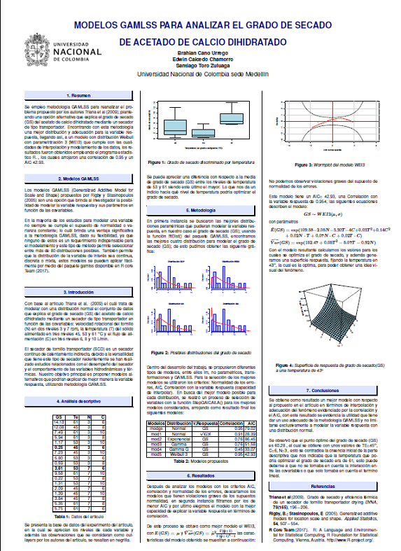

Aqui colgare un par de trabajos realizados en el transcurso de mi carrera

#aplicación sobre Densidad de una Beta

```{r, echo=FALSE}
knitr::include_app("https://bencuben.shinyapps.io/my-app/",height = "600px")
```

#poster sobre aplicaciones en GAMLSS

```{r, out.width = "400px",  fig.align='center',echo=F}


```
